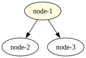
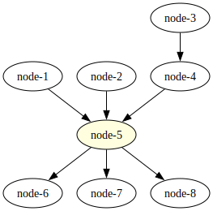
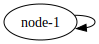
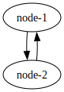
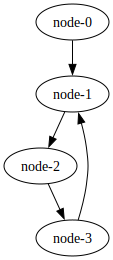

# Examples

## One Way Networks

### Once Single Seed One Way Linear Network

In this network configuration, a single seed node initiates the transmission of data within the network. The data
follows a linear path, progressing sequentially through each node until it reaches the terminal or sink node.


```shell
go run . draw oncenet
dot -Tsvg -o shapes/oncenet.svg bin/oncenet.gv
```

```shell
go run . up oncenet
```

### Infinite Single Seed One Way Linear Network

This configuration represents a basic setup where information flows from the seed node, passing through each
intermediate node until it reaches the end of the network. At each node, incoming events are processed according to its
implemented function before being forwarded to the next node in the chain.


```shell
go run . draw onewaynet
dot -Tsvg -o shapes/onewaynet.svg bin/onewaynet.gv
```

```shell
go run . up onewaynet
```

### Single Seed Multi Nodes Broadcast Network

This configuration closely resembles the basic setup, with information flowing from the seed node through each
intermediate node until it reaches the network's end. However, in this variation, after processing, intermediate nodes
broadcast incoming events to the subsequent nodes in the chain.


```shell
go run . draw fan1seednet
dot -Tsvg -o shapes/fan1seednet.svg bin/fan1seednet.gv
```

```shell
go run . up fan1seednet
```

### Infinite Single Seed One Way Distribution Network

This configuration illustrates a simple arrangement where the seed node distributes events among its connected nodes.



```shell
go run . draw distributornet
dot -Tsvg -o shapes/distributornet.svg bin/distributornet.gv
```

```shell
go run . up distributornet
```

### Fan In Fan Out Broadcast Network

This represents a fan-in fan-out broadcast network configuration. Here, a summarization node gathers all events in one
location and then disperses them, broadcasting incoming events to subsequent nodes in the chain.


```shell
go run . draw fannet
dot -Tsvg -o shapes/fannet.svg bin/fannet.gv
```

```shell
go run . up fannet
```

### Fan In Fan Out Distribution Network

This is a fan-in fan-out distribution network setup. In this configuration, an aggregator node centralizes all events
before distributing incoming events to subsequent nodes in the chain.



```shell
go run . draw fandistributsnet
dot -Tsvg -o shapes/fandistributsnet.svg bin/fandistributsnet.gv
```

```shell
go run . up fandistributsnet
```

### Double Seed Funnel Network

In this setup, there are two seed nodes that serve as the initial sources of information. These nodes funnel data
towards a central point where they converge.


```shell
go run . draw subwaynet
dot -Tsvg -o shapes/subwaynet.svg bin/subwaynet.gv
```

```shell
go run . up subwaynet
```

## Loop Networks

### One Node Self Loop Network

This setup features a self-loop with a single node in the network. However, in the absence of any events within the
system, there is no communication taking place, resulting in an indefinite period of waiting.



```shell
go run . draw selfloopnet
dot -Tsvg -o shapes/selfloopnet.svg bin/selfloopnet.gv
```

```shell
go run . up selfloopnet
```

### Once Single Seed One Node Self Loop Network

A single seed node initiates the flow of information within the network. Another node, acting as a processor, handles
incoming data and redirects it back to itself, thus establishing a continuous loop within the network.


```shell
go run . draw selfloop1seednet
dot -Tsvg -o shapes/selfloop1seednet.svg bin/selfloop1seednet.gv
```

```shell
go run . up selfloop1seednet
```

### Two Nodes Loop Network (Two Nodes Ping-Pong Network)

This setup implements a loop with two nodes. However, without any events present in the system, there is no
communication occurring between the nodes, leading to an indefinite wait.



```shell
go run . draw pingpongnet
dot -Tsvg -o shapes/pingpongnet.svg bin/pingpongnet.gv
```

```shell
go run . up pingpongnet
```

### Once Single Seed Two Nodes Loop Network (Once Seeded Two Nodes Ping-Pong Network)


```shell
go run . draw pingpong1seednet
dot -Tsvg -o shapes/pingpong1seednet.svg bin/pingpong1seednet.gv
```

```shell
go run . up pingpong1seednet
```

### Infinite Single Seed Two Nodes Loop Network

This configuration may seem straightforward initially, but it encounters a hurdle with race conditions. As the seed node
continues to emit more events, the communication could eventually, based on link channel size, grind to a halt resulting
in a deadlock.


```shell
go run . draw badnet
dot -Tsvg -o shapes/badnet.svg bin/badnet.gv
```

```shell
go run . up badnet
```

### Once Single Seed Multi Nodes Loop Network (Once Seeded Multi Nodes Ping-Pong Network)



```shell
go run . draw loop1seednet
dot -Tsvg -o shapes/loop1seednet.svg bin/loop1seednet.gv
```

```shell
go run . up loop1seednet
```

### Once Double Seed Two Nodes Loop Network (Once Double Seeded Two Nodes Ping-Pong Network)


```shell
go run . draw pingpong2seednet
dot -Tsvg -o shapes/pingpong2seednet.svg bin/pingpong2seednet.gv
```

```shell
go run . up pingpong2seednet
```

