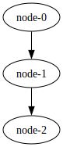
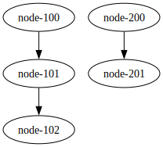
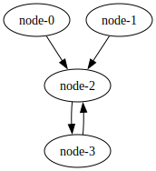

# Examples

## One Way Networks

### Classic One Way Path

This configuration represents a basic setup where information flows from the seed node, passing through each
intermediate node until it reaches the end of the network. At each node, incoming events are processed according to its
implemented function before being forwarded to the next node in the chain.



```shell
go run . up onewaynet
```

```shell
go run . draw onewaynet
dot -Tsvg -O bin/onewaynet.gv
```

### Single Seed Multi Nodes Broadcasting Network

This configuration closely resembles the basic setup, with information flowing from the seed node through each
intermediate node until it reaches the network's end. However, in this variation, after processing, intermediate nodes
broadcast incoming events to the subsequent nodes in the chain.


```shell
go run . draw fan1seednet
dot -Tsvg -O bin/fan1seednet.gv
```

```shell
go run . up fan1seednet
```

### Fan In Fan Out Network

This represents a classic fan-in fan-out network configuration. Here, a summarization node gathers all events in one
location and then disperses them, broadcasting incoming events to subsequent nodes in the chain.


```shell
go run . draw fannet
dot -Tsvg -O bin/fannet.gv
```

```shell
go run . up fannet
```

### Double Seed Funnel Network



```shell
go run . draw subwaynet
dot -Tsvg -O bin/subwaynet.gv
```

```shell
go run . up subwaynet
```

## Loop Networks

### Single Node Self Loop Network

TODO

### Two Nodes Loop Network (Classic Ping-Pong Network)

TODO

### Once Single Seed Two Nodes Loop Network (Once Seeded Two Nodes Ping-Pong Network)


```shell
go run . draw pingpong1seednet
dot -Tsvg -O bin/pingpong1seednet.gv
```

```shell
go run . up pingpong1seednet
```

### Once Single Seed Multi Nodes Loop Network (Once Seeded Multi Nodes Ping-Pong Network)


```shell
go run . draw loop1seednet
dot -Tsvg -O bin/loop1seednet.gv
```

```shell
go run . up loop1seednet
```

### Once Double Seed Two Nodes Loop Network (Once Double Seeded Two Nodes Ping-Pong Network)



```shell
go run . draw pingpong2seednet
dot -Tsvg -O bin/pingpong2seednet.gv
```

```shell
go run . up pingpong2seednet
```

### Infinite Single Seed Two Nodes Loop Network (Network that doesn't work)


This configuration may seem straightforward initially, but it encounters a hurdle with race conditions. As the seed node
continues to emit more events, the communication could eventually, based on link channel size grind to a halt, resulting
in a deadlock.

```shell
go run . draw badnet
dot -Tsvg -O bin/badnet.gv
```

```shell
go run . up badnet
```
