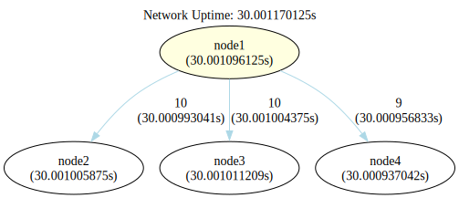
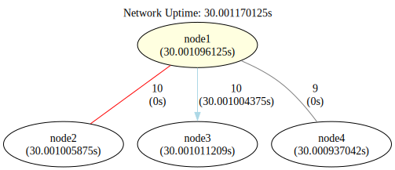
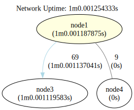
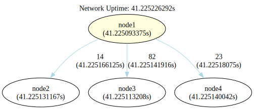

### Infinite Single Seed One Way Distribution Network

This configuration illustrates a simple arrangement where the seed node distributes events among its connected nodes.


```shell
go run .
```

```shell
dot -Tsvg -o shapes/network.svg bin/network.gv
dot -Tsvg -o shapes/network-tally.svg bin/network-tally.gv
dot -Tsvg -o shapes/network-modified.svg bin/network-modified.gv
dot -Tsvg -o shapes/network-modified-tally.svg bin/network-modified-tally.gv
dot -Tsvg -o shapes/network-purged.svg bin/network-purged.gv
dot -Tsvg -o shapes/network-undone.svg bin/network-undone.gv
dot -Tsvg -o shapes/network-undone-tally.svg bin/network-undone-tally.gv
```

Network after processing some data:

 

Network is modified to pause communication between `node1` and `node4` and link from `node1` to `node2` is removed.  

 

Further data processing results in no communication between `node1` and `node4`, and between `node1` and `node2`:


Network is purged to clean up removed links and isolated nodes:



Network is modified again to put back `node2` and linked to `node1` and communication between `node1` and `node4` is resumed.


Network after processing data with re-addition of `node2` linked to `node1` and communication between `node1` and `node4` being resumed:


