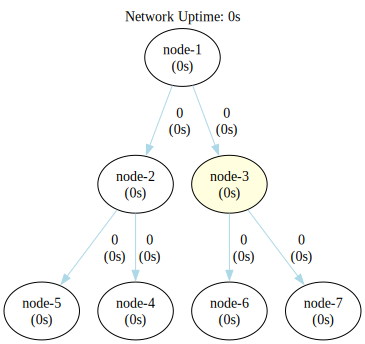

### Single Seed Multi Nodes Broadcast Network

This configuration closely resembles the basic setup, with information flowing from the seed node through each
intermediate node until it reaches the network's end. However, in this variation, after processing, intermediate nodes
broadcast incoming events to the subsequent nodes in the chain.



```shell
go run .
```

```shell
dot -Tsvg -o shapes/network.svg bin/network.gv
dot -Tsvg -o shapes/network-tally.svg bin/network-tally.gv
```


