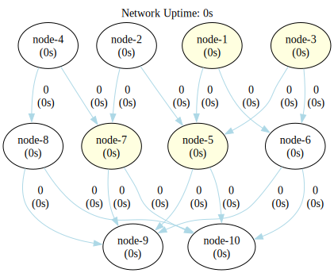
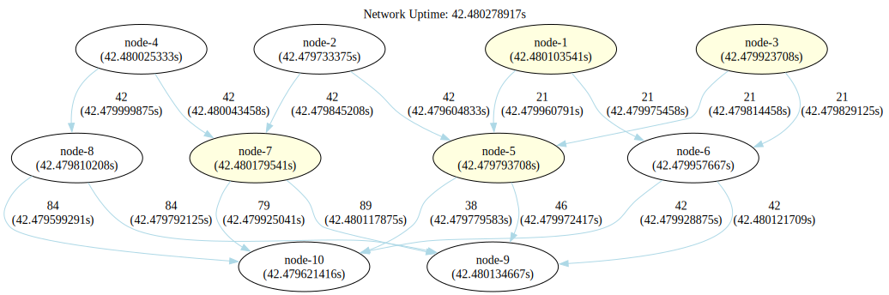

### Fan In Fan Out Distribution Network

This is a fan-in fan-out distribution network setup. In this configuration, an aggregator node centralizes all events
before distributing incoming events to subsequent nodes in the chain.



```shell
go run .
```

```shell
dot -Tsvg -o shapes/network.svg bin/network.gv
dot -Tsvg -o shapes/network-tally.svg bin/network-tally.gv
```


