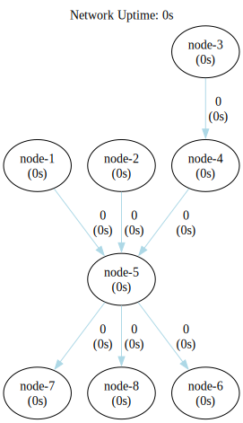
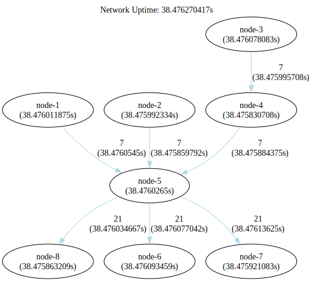

### Fan In Fan Out Broadcast Network

This represents a fan-in fan-out broadcast network configuration. Here, a summarization node gathers all events in one
location and then disperses them, broadcasting incoming events to subsequent nodes in the chain.



```shell
go run .
```

```shell
dot -Tsvg -o shapes/network.svg bin/network.gv
dot -Tsvg -o shapes/network-tally.svg bin/network-tally.gv
```


