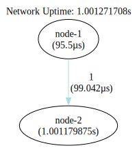

### Once Single Seed One Way Linear Network

In this network configuration, a single seed node initiates the transmission of data within the network. The data
follows a linear path, progressing sequentially through each node until it reaches the terminal node.


```shell
go run .
```

```shell
dot -Tsvg -o shapes/network.svg bin/network.gv
dot -Tsvg -o shapes/network-tally.svg bin/network-tally.gv
```


