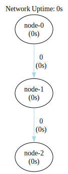
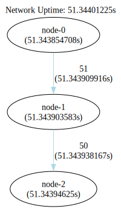

### Infinite Single Seed One Way Linear Network

This configuration represents a basic setup where information flows from the seed node, passing through each
intermediate node until it reaches the end of the network. At each node, incoming events are processed according to its
implemented function before being forwarded to the next node in the chain.



```shell
go run .
```

```shell
dot -Tsvg -o shapes/network.svg bin/network.gv
dot -Tsvg -o shapes/network-tally.svg bin/network-tally.gv
```


