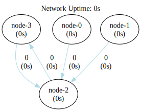
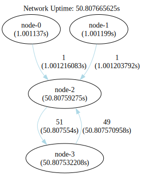

### Once Double Seed Two Nodes Loop Network (Once Double Seeded Two Nodes Ping-Pong Network)



```shell
go run .
```

```shell
dot -Tsvg -o shapes/network.svg bin/network.gv
dot -Tsvg -o shapes/network-tally.svg bin/network-tally.gv
```


