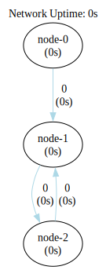

### Infinite Single Seed Two Nodes Loop Network

This configuration may seem straightforward initially, but it encounters a hurdle with race conditions. As the seed node
continues to emit more events, the communication could eventually, based on link channel size, grind to a halt resulting
in a deadlock.



```shell
go run .
```

```shell
dot -Tsvg -o shapes/network.svg bin/network.gv
dot -Tsvg -o shapes/network-tally.svg bin/network-tally.gv
```


