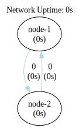
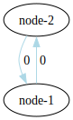

### Two Nodes Loop Network (Two Nodes Ping-Pong Network)

This setup implements a loop with two nodes. However, without any events present in the system, there is no
communication occurring between the nodes, leading to an indefinite wait.



```shell
go run .
```

```shell
dot -Tsvg -o shapes/network.svg bin/network.gv
dot -Tsvg -o shapes/network-tally.svg bin/network-tally.gv
```


