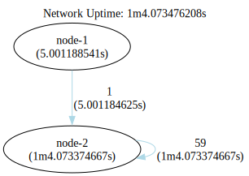

### Once Single Seed One Node Self Loop Network

This configuration effectively addresses the issue of "indefinite wait" by introducing a single seed node to kickstart
the flow of information throughout the network. Additionally, another node, serving as a processor, manages incoming
data and channels it back to itself, creating a perpetual loop within the network.


```shell
go run .
```

```shell
dot -Tsvg -o shapes/network.svg bin/network.gv
dot -Tsvg -o shapes/network-tally.svg bin/network-tally.gv
```


