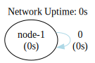
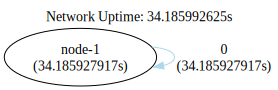

### One Node Self Loop Network

This setup features a self-loop with a single node in the network. However, in the absence of any events within the
system, there is no communication taking place, resulting in an indefinite period of waiting.



```shell
go run .
```

```shell
dot -Tsvg -o shapes/network.svg bin/network.gv
dot -Tsvg -o shapes/network-tally.svg bin/network-tally.gv
```


